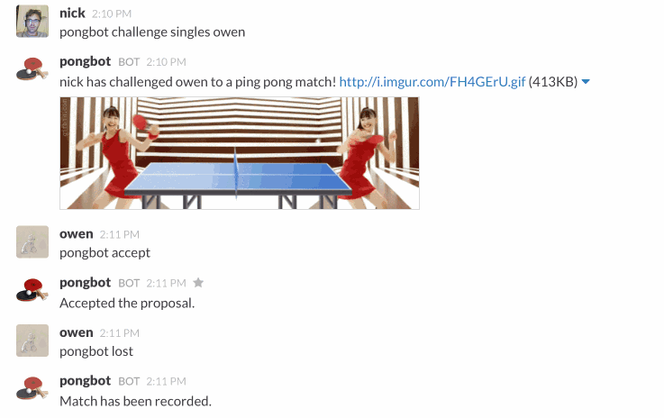

# Pongbot
Slack Bot for Ping Pong tracking.

[](https://travis-ci.org/andrewvy/slack-pongbot)

[](https://heroku.com/deploy)



# Installation

Deploy with your preferred solution, eg. with [Heroku](https://devcenter.heroku.com/articles/getting-started-with-nodejs).

Administrative commands require the `ADMIN_SECRET` environment to be set.

```
heroku config:add ADMIN_SECRET=secret
```

Visit `https://yourteamname.slack.com/services/new` and choose "Outgoing WebHooks." Choose which channels you would like pongbot active in, a trigger word with `pongbot`, and the url that you deployed to.

# Using Pongbot from Slack

Make sure you're registered with pongbot.

```
pongbot register
```

Challenge someone, or a team.

Singles:


```
pongbot challenge singles <opponent's name>
```

Doubles:

```
pongbot challenge doubles <teammate's name> against <opponent_1> <opponent_2>
```

Let them run this, to accept the challenge. Only one other person (teammate or opponent) needs to accept to confirm the challenge.

```
pongbot accept
```

If you can't play now, `pongbot decline`.

Game On!

Record the match. Only the person/team that lost can record, it'll automatically change everyone's scores/rankings.

```
pongbot lost
```


# Other Commands

* `pongbot decline` - Decline's any proposed match.
* `pongbot chicken` - Chicken out of your own challenge before it is accepted, or out of an accepted challenge (as the challenger or challenged).
* `pongbot leaderboard <1-infinity>` - Shows the top players, sorted by Elo.
* `pongbot rank <someone's name>` - Gets that person's stats. If none given, it will return your own stats.
* `pongbot source` - Get's Pongbot's Github repository.
* `pongbot reset <name> <secret>` - Admin-only command that reset's a person's stats.
* `pongbot new_season <secret>` - Admin-only command that reset's all stats and begins a new season.

# API

See [API Documentation](API.md).

# License & Copyright

Copyright (c) 2014-2015, Andrew Vy and Contributors

ISC License, see [LICENSE](LICENSE) for details.

